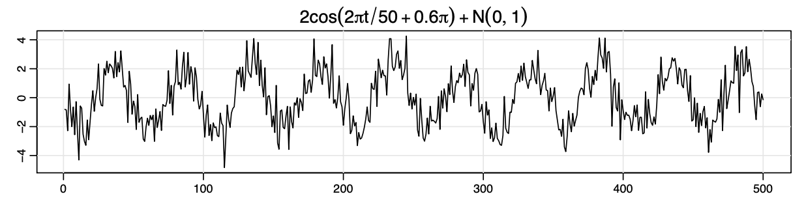

# Timeseries 1

## Summary
This course presents a comprehensive treatment of timeseries data suitable for first- and second-year graduate students in Bioinformatics and Data Sciences.
The course is arranged as 12 weeks of lectures (2h/week) with 8 weekly homework problem sets.
Two mid-semester projects will help students develop practical programming skills necessary for accessing and analyzing publicly-available data.
The course closes with a machine learning competition focused on identification and annotation of freezing of gait episodes in kinematic data of patients with Parkinson's disease.

## Prerequisites
Previous coursework in linear algebra and statistics / probability theory.
Fluency with programming in R, Matlab, Python, or similar.

## Text
There is no dedicated text. Some material is adapted from texts by [Lathi](reference/Lathi.pdf) and [Shumway](reference/Shumway.pdf).

## Course Objectives
This course will introduce students to theoretical and applied aspects of timeseries analysis through lectures, homework, and a second-quarter project.
Following this course students should be able to: 
1. Understand fundamental duality between time- and frequency- domain representation of signals.
1. Understand fundamentals of sampling and aliasing.
1. Access publicly-available timeseries datasets and prepare them for analyses that appropriately consider repeated measurements of individual patients at different nominal times.
1. Apply common linear and nonlinear signal conditioning approaches to noisy data.
1. Calculate common estimates of time-varying spectral energy and other summary statistics.
1. Design and train a simple classifier that can predict changes in time-varying signal energy.

## Grading
1. Homework (25%) will consist of math problems and will help students develop analytical and programming skills.
1. Two mid-semester projects (25%) will help students develop practical programming skills necessary for accessing and analyzing publicly-available data. Both mid-semester projects will be available from the second week of class and can be turned in any time before the resources for the end-of-semester project are released.
1. An end-of-semester project (50%) will provide students with practical experience in identifying health-related events in prospectively-collected research patient data. Students will use the PDFOG kinematic dataset to predict the onset of freezing of gait episodes identified from video recordings by an expert rater. This will be possible to do only techniques presented in the course, but students may identify and implement approaches from the literature.

## Outline

1. Introduction to timeseries data
    1. Representations of time in informatics data
        1. Timescales - 1 kHz to 1 sample/year
        1. Explicit vs. implicit representations of time
        1. Time to event: censored data and survival analysis
        1. Causal and non-causal data
        1. Course focus: signals in which time is represented implicitly and sampled regularly, "high frequency" in statistics nomenclature
    1. Simple operations for discovering a signal embedded in additive noise
        1. Regression onto a hypothesized basis
        1. Moving average smoothing
        1. Frequency-domain filtering
        1. Autoregressive estimation
1. Spectral analysis and filtering
    1. Equivalence of frequency and time domain representations of signals
    1. Signal representation by Fourier series
    1. Aperiodic signal representation by the Fourier Transform
    1. Sampling and aliasing
        1. The sampling theorem
        1. The Discrete Fourier Transform (DFT)
    1. Decimation and upsampling
    1. Linear filters
    1. Impacts of windowing on frequency content
    1. Measures of signal size, energy, and power in the spectral domain
    1. Mid-semester project 1: calculation of low-frequency/high-frequency (LF/HF) ratio of heart rate variability ([McSharry](reference/McSharry.pdf)) in a publicly-available dataset. Mid-semester project 1 will be scored based on performance vs. Dr. McKay's implementation.
        1. Accessing publicly-available data repositories
        1. Data wrangling for preparation of datasets
    1. Optional topics: invertible projection matrix representations
        1. DFT projection
        1. DWT projection
        1. SVD/Karhunen–Loève/PCA projection
1. Time series regression and autoregressive / ARIMA models
    1. Autoregressive moving average models
    1. Difference equations
    1. Autocorrelation and partial autocorrelation
    1. Forecasting and backcasting
    1. Building ARIMA models
    1. Estimating covariance structures in longitudinal studies (e.g., [Lu](reference/Lu.pdf))
    1. Mid-semester project 2: ARIMA approach for prediction of avian influenza H5N1 outbreaks [Kane](reference/Kane.pdf) in a publicly-available dataset. Mid-semester project 1 will be scored based on performance vs. Dr. McKay's implementation.
1. Final project: detection of tremulous freezing episodes in unpublished kinematic data of PD patients annotated by clinical collaborators.
    1. Two lectures will cover clinical and practical aspects of Parkinson's disease.
    1. In year 1 of the class, the final project will be scored based on reconstruction of expert labels (start and stop of FOG episodes) provided by a clinical collaborator. One approach is that provided by [Moore](reference/Moore.pdf). In later years, the final project will build upon the work of previous cohorts and will identify kinematic features associated with medication state during testing (OFF and ON medication for most participants) and aspects of disease phenotype.

